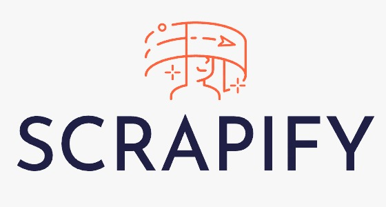

# Scrapify

    

## AR Social Media and Scrapbooking platform

Scrapify lets you **document, organise and share your memories** in the form of **digital scrapbooks** tied to **real world locations**.

## Flutter app

The mobile app was built with the cross-platform app development framework **[Flutter](https://flutter.dev/)**, using **[Firebase](https://firebase.google.com/)** for its backend.
